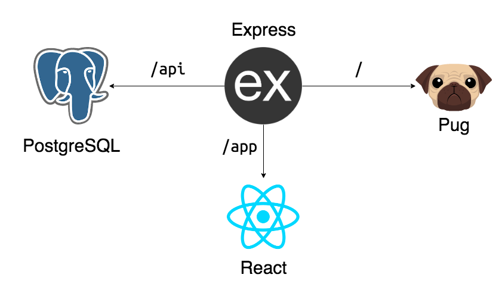

# Todo App built with PERN stack

This is a typical todo app using the PERN stack (PostgreSQL, Express, React, NodeJS).

## Features

- Kanban-style todo list with 3 states: To Do, In progress, Completed
- Set importance of Todo; sorts your columns by priority
- One-click completion clearing for a clean board

## Architecture

### `npm start:dev`

Runs the app in the development mode. This will run the Express server for the server-side of the application as well as the react server for the frontend.

- ExpressJS: http://localhost:8080
- React: http://localhost:3000

In the development mode, requests made to the API from the frontend ae proxied to the Express server. On the server, if accessing the /app route, it will redirect to http://localhost:3000. Since nodemon is used to run the server, it will be listening to changes for faster development.

### `npm start:prod`

Runs the app in production mode.\
NOTE: you need to build the react app first to use this command or else the /app route will fail. All requests will be on port 8080.

### `npm build`

Runs the build command in the react app and will copy the build folder into the top level public folder. It will also rename the index.html file to app.html to prevent rewrites to / as the app exists under /app route.

## Environment Variables

- DB_USER = Username for Postgres
- DB_PASS = Password for Postgres
- DB_HOST = Where the DB exists (should be localhost if all on the same server)
- DB_PORT = Port where the DB exists (default is 5432)
- DB_NAME = Name of the database to connect to
